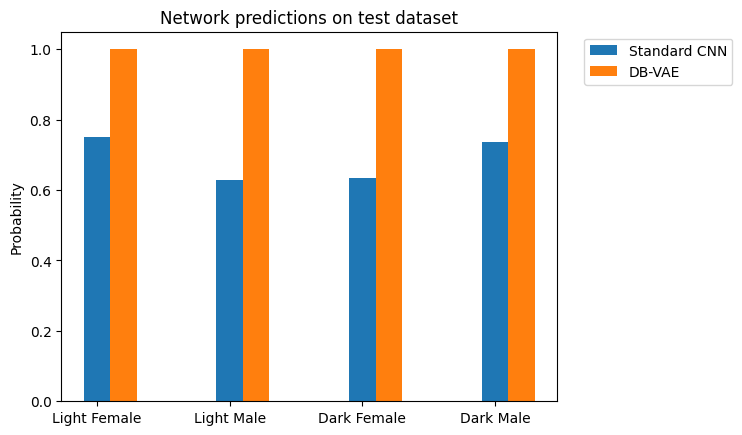

# Debiasing Variational Autoencoder Model

This project implements and trains a DB-VAE model based on one of the MIT Introduction to Deep Learning exercises.

> © MIT Introduction to Deep Learning
>
> http://introtodeeplearning.com

The code has been adapted and implements the paper:
> Alexander Amini, Ava P. Soleimany, Wilko Schwarting, Sangeeta N. Bhatia, and Daniela Rus. 2019. 
> Uncovering and Mitigating Algorithmic Bias through Learned Latent Structure.

The main objective of the model is to search for and understand the model learned latent representations to identify biases in the datasets and correct them by giving a higher probability to the underrepresented datasets during training.

# Project Structure

You can train the model using:

```
.
├── data/
│   └── faces/        # Test face images organized by categories (LF, LM, DF, DM)
├── src/
│   ├── model.py      # DB-VAE model implementation
│   ├── train.py      # Training script
│   └── evals.py      # Evaluation script
│    └──utils/
│       └── datasetLoader.py # Dataset loading utilities
└── checkpoints/      # Directory for saved model checkpoints
└── notebooks/      # Notebook used for experimentation and data visualization
```

# Model Architecture

The DB-VAE model consits of

- An encoder network that predicts both class labels and latent space variables
- A decoder network that reconstructs images from the latent space
- A training procedure that focus on underrepresented samples in the latent space

The model helps mitigate bias by giving higher probability to training samples that are underrepresented in the latent distribution.

# Requirements

You can install the dependencies using:

`pip install -r requirements.txt`

# How to Run

You can train the model using:

`python src/train.py --epochs 10 --batch-size 32 --latent-dim 144`

Available training parameters:

- epochs: Number of training epochs (default: 2)
- batch-size: Batch size for training (default: 64)
- learning-rate: Learning rate for optimizer (default: 5e-4)
- latent-dim: Dimension of the latent space (default: 128)
- bins: Number of histogram bins for debiasing (default: 10)
- smoothing-fac: Smoothing factor for histogram (default: 0.001)
- output-dir: Directory to save checkpoints (default: "checkpoints")
- save-every: Save checkpoint every N epochs (default: 1)

# Evaluation
To evaluate the trained model on test faces:
`python src/evals.py`

This will load the latest checkpoint from the "checkpoints" directory and evaluate the model on test face images from different demographic groups (Light Female, Light Male, Dark Female, Dark Male).

# Results

During the experimentation, a simple CNN was used to compare its accuracy on the test faces againts the DB-VAE model.

As shown in the figure we can notice the DB-VAE model was able to learn to generalize across all faces clases using the debaising algoritm, while the simple CNN was influenced by the biased dataset and achieved higher accuracy only for certain classes.


